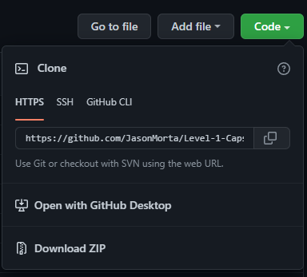
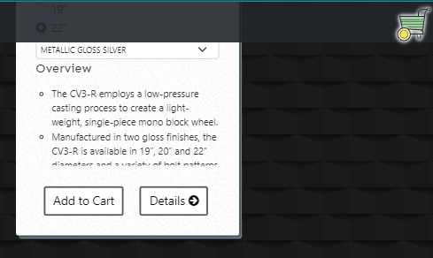
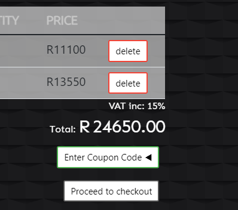
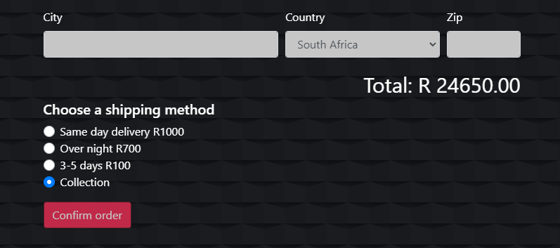
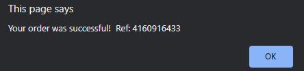

*WD L1T15 - Capstone Project II*
# My Online store

In this project i created a store that sells vehicle rims. this is combination of all the level 1 tasks i've completed. similar to other online stores, it allows users to add items to the cart and on the cart page, remove and item. users also have the option to add a promotion code for a discount price and choose from several shipping methos that adds the to total price.

## Table of Contnets
- How to install project locally How to instal project locally.
- Usage
- Credits

### How to install project locally
Click the green code button, then download ZIP.
After download. Extract the content and open index.html

### Usage
- The store has 8 pages. On enter you will land on the welcome page which is followed by the catalogue page.
- When you add an item to the cart. The cart icon will be visible and can take you to the cart page.

- Cart page will display the total amount for all items in cart including VAT. You also have an option to add a coupon code for a discount.

- On the shipping details page users can also choose a shipping method.

- After processing the order, user will receive a ref number and taken back to landing page.

## Credits
[*Jason Morta*](https://github.com/JasonMorta "*Jason Morta*")
